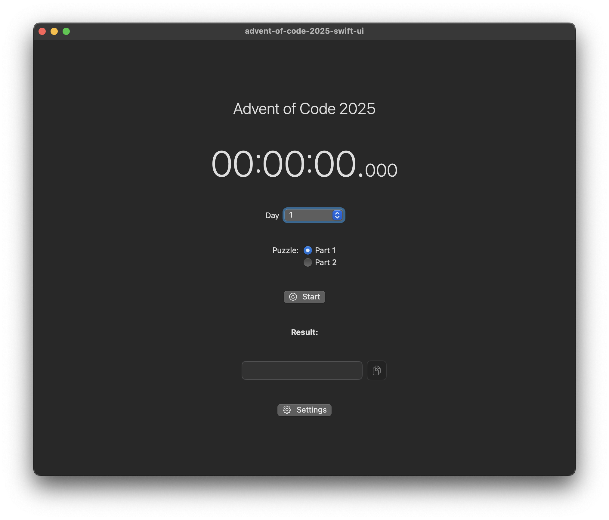

#  Advent of Code 2025

Learning to code with swift.

Edit the files in `advent-of-code-2025-swift-ui` in the corresponding `Dayxy.swift` file.
You can then run it in the UI.

For some puzzles you should be aware that some IDEs/text editors might delete trailing whitespaces from your input files which might corrupt the solutions.

This app will automatically put the solution in your clipboard and alert you if it the same solution already exists in your clipboard.

